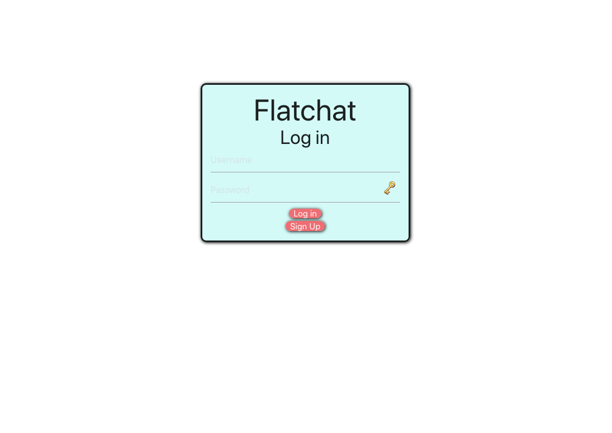
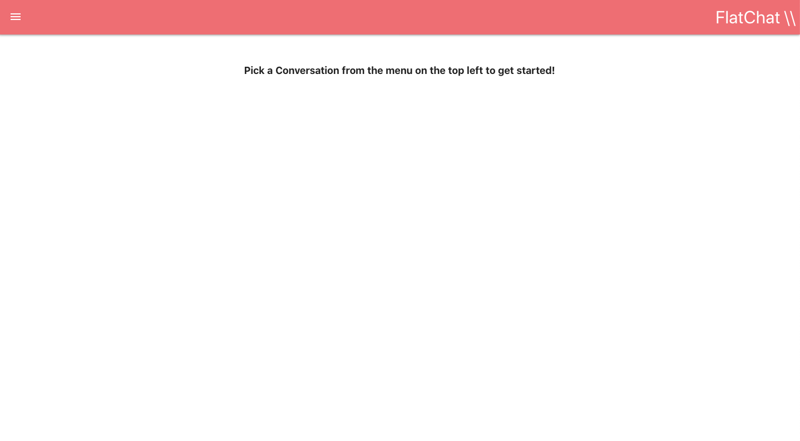
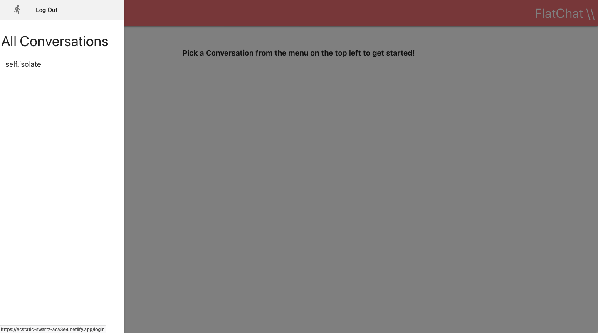
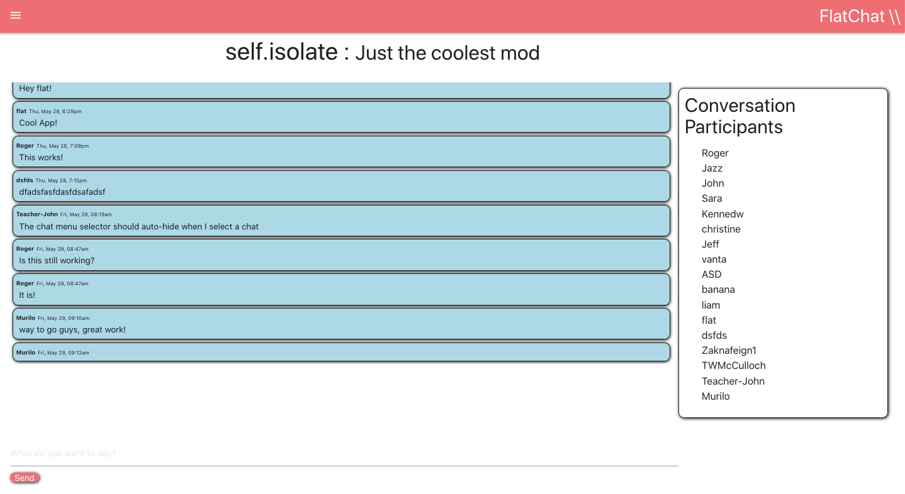

# Flatchat

A realtime chat application. This repo contains our React frontend.

## Screenshots

### Login

### Home

### Conversation Select

### Conversation View

## Technology Used

- React frontend
- ActionCable via react-actioncable-provider
- Automatic deployment via Github and Netlify

## Features

- Login/Signup
- Conversation selection. Currently there is only one 'main room' available.
- Send and receive messages in real time!
- View a list of conversation participants.
- Logout

## Installation/Deployment

- Local installation
    - Grab a copy of our [backend server](https://github.com/strangrjrjr/flatchat_backend). Follow the instructions there.
    - Clone/download this project's main branch.
    - `cd` into the main directory and run `npm install && npm start`
- Deployed installation
    - Visit [our live instance](https://ecstatic-swartz-aca3e4.netlify.app/)!

### Netlify status

A project by [John Souza](https://github.com/jls-github), [Jazz Bozner](https://github.com/jazzbozner), and [Roger Robertson Jr](https://github.com/strangrjrjr).
